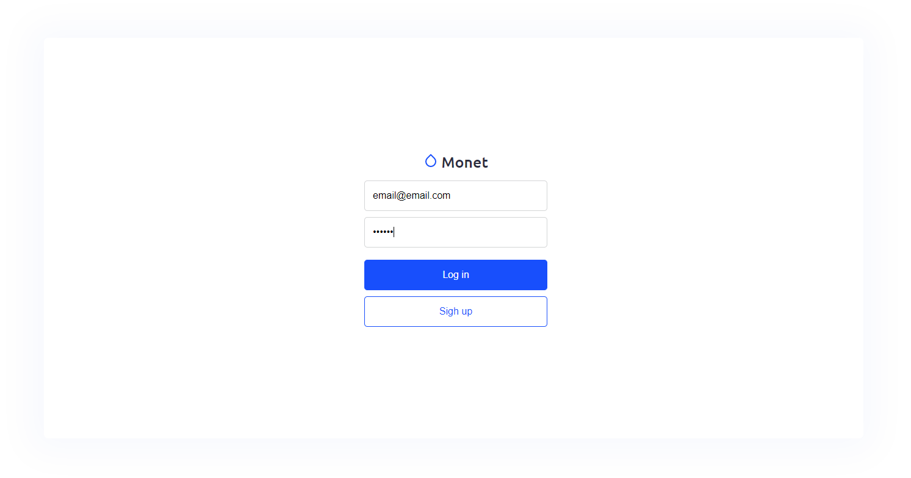
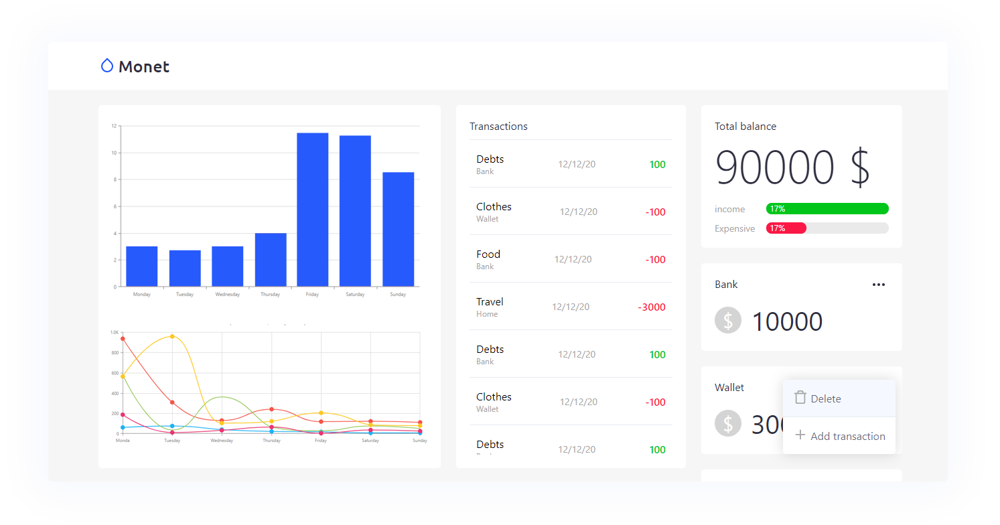

# Monet

#### Monet - is a personal budgeting app on React

In the project directory, you can run:

### `npm start`

Runs the app in the development mode. 
Open [http://localhost:3000](http://localhost:3000) to view it in the browser.

### Releases:

- [x] UX/UI library created
- [x] Wallets
- [x] Transaction dashboard
- [ ] Charts
- [x] Authentication 

